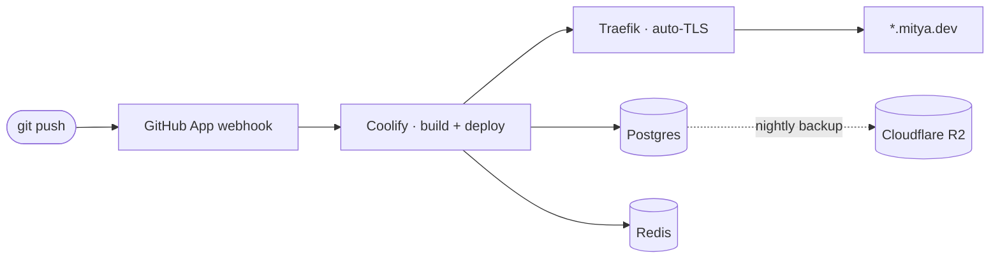

<!-- ============================== HERO ============================== -->

# ⛩&nbsp; mitya kurs

<!-- mitekk/mitekk — profile README. NEON DARK DASHBOARD variant (revised 2026-06-13).
     Dark-first BY DESIGN: the stat panels render as dark cards even in light mode (intentional, like a dashboard).
     No <script>, no CSS, no style= attributes (GitHub strips them). Animation only from allowlisted external services.
     Accent = neon ember #FF5A36. To retheme, find/replace FF5A36 (and the light-mode pair E23C1E) everywhere.
     Dropped by decision (2026-06-12): followers badge, view counter, trophy row (0-interest on a 0-follower account).
     Dropped by decision (2026-06-13): currently-building, stats card (public instance can't count private
     commits), snake + its workflow, connect (hero badges carry the links), torii.txt easter egg, achievements footer.
     pool-stars source is private: live link only, no repo link. spark is private: omitted.
     Sections are commented; delete any block you don't want. -->

<!-- Typing tagline. Animated SVG from an allowlisted service (survives camo). Dual <source> = crisp in light AND dark. -->
<picture>
  <source media="(prefers-color-scheme: dark)" srcset="https://readme-typing-svg.demolab.com?font=JetBrains+Mono&weight=600&size=20&pause=1200&color=FF5A36&center=true&vCenter=true&width=800&height=50&lines=Senior+Full-Stack+Developer+%26+Team+Lead+%C2%B7+14+years;the+server+is+the+source+of+truth.+the+client+is+a+charming+liar." />
  <source media="(prefers-color-scheme: light)" srcset="https://readme-typing-svg.demolab.com?font=JetBrains+Mono&weight=600&size=20&pause=1200&color=E23C1E&center=true&vCenter=true&width=800&height=50&lines=Senior+Full-Stack+Developer+%26+Team+Lead+%C2%B7+14+years;the+server+is+the+source+of+truth.+the+client+is+a+charming+liar." />
  
</picture>

  

<!-- quick badges. Uniform ember-on-dark recipe so they read as one set, not a pile.
     (simple-icons dropped LinkedIn, and has no generic globe — the website + LinkedIn logos
     are embedded as base64 data-URIs; the white fill is baked into the SVG, logoColor is ignored.) -->

<!-- ============================== INTRO ============================== -->

Senior full-stack developer &amp; team lead — 14 years shipping products and leading teams. I build things that ship: real-time backends, server-authoritative game logic, and agentic tooling. Mostly TypeScript, some Python, increasingly with an AI pair in the loop. Based in the Sharon, Israel; works in Hebrew &amp; English. Portfolio &amp; CV at **[profile.mitya.dev](https://profile.mitya.dev)**, project hub at **[mitya.dev](https://mitya.dev)** — and everything with a live link below runs on [infrastructure I operate myself](#how-it-ships).

<!-- ===================== CONTRIBUTION ACTIVITY ===================== -->
<!-- Both read the contribution calendar, so they DO include private contributions. Dark cards in both modes (intentional).
     Activity graph pinned to a 60-day range (days=60). Public demolab/vercel instances may rate-limit. -->

 

<!-- ============================ SELECTED WORK ============================ -->
### selected work

<!-- pool-stars: source is private (deliberate) — live demo link only, no repo link. -->
<table>
<tr>
  <td><a href="https://github.com/mitekk/portfolio"><b>portfolio</b></a></td>
  <td>Personal portfolio &amp; CV — animated intro, experience &amp; toolbox, readable/downloadable CV. Prerendered to static HTML, shares cleanly.</td>
  <td><a href="https://profile.mitya.dev"><code>profile.mitya.dev</code></a></td>
</tr>
<tr>
  <td><a href="https://github.com/mitekk/pulse"><b>pulse</b></a></td>
  <td>Real-time microblogging — threaded posts/replies, follows, DMs, live timeline, notifications, trends.</td>
  <td><a href="https://pulse.mitya.dev"><code>pulse.mitya.dev</code></a></td>
</tr>
<tr>
  <td><a href="https://github.com/mitekk/codeViber"><b>codeViber</b></a></td>
  <td>Claude Code scaffold — raw requirement → validated code via specialist subagents and a persistent state machine.</td>
  <td></td>
</tr>
<tr>
  <td><a href="https://github.com/mitekk/lunaland"><b>lunaland</b></a></td>
  <td>Social/sweepstakes casino PoC — provably-fair slots, Luna + Sweeps Coins economy, VIP tiers &amp; daily bonuses.</td>
  <td><a href="https://lunaland.mitya.dev"><code>lunaland.mitya.dev</code></a></td>
</tr>
<tr>
  <td><b>pool-stars</b></td>
  <td>Two-player, turn-based 8-ball pool you join by short code — break the rack, run your group, sink the 8, with both players watching every shot replay live. (source private)</td>
  <td><a href="https://pool-stars.mitya.dev"><code>pool-stars.mitya.dev</code></a></td>
</tr>
<tr>
  <td><a href="https://github.com/mitekk/arbox-schedule"><b>arbox-schedule</b></a></td>
  <td>Hands-free class-booking bot — grabs preferred gym lessons the instant registration opens, joins standby when full, auto-confirms freed slots.</td>
  <td></td>
</tr>
<tr>
  <td><a href="https://github.com/mitekk/mashov"><b>mashov</b></a></td>
  <td>Parent command center — a calm, mobile-first Hebrew/RTL briefing over Israel's Mashov school portal: every kid's messages, homework &amp; behavior in one 30-second glance.</td>
  <td><a href="https://mashov.mitya.dev"><code>mashov.mitya.dev</code></a></td>
</tr>
</table>

<!-- ========================= MORE EXPERIMENTS ========================= -->

<b>🧪 more experiments</b>

 

- **[zeroBugPolicyGame](https://github.com/mitekk/zeroBugPolicyGame)** — a tiny browser game: clear a falling backlog of bug &amp; task tickets before it overflows. For developers who get the joke.
- **[micro-fe](https://github.com/mitekk/micro-fe)** — micro-frontend PoC: a Vue host lazy-loads two independently-built remotes (one Vue, one React) at runtime via Module Federation.
- **[react-native-auth](https://github.com/mitekk/react-native-auth)** — a complete mobile auth journey (register, login, password reset, email verification) in React Native + GraphQL.
- **[hetzner-server-radar](https://github.com/mitekk/hetzner-server-radar)** — out-of-stock radar for Hetzner Cloud: an email the moment your server type is available again.
- **[game-of-life](https://github.com/mitekk/game-of-life)** — Conway's Game of Life, ticking generation by generation in the browser.
- **[Bomberman](https://github.com/mitekk/Bomberman)** — retro tile-based arena: place bombs, grab power-ups, outsmart bots.
- **[tictactoe](https://github.com/mitekk/tictactoe)** — tiny full-stack tic-tac-toe against an AI opponent.

<!-- ============================== TOOLBOX ============================== -->
### toolbox

<!-- Uniform ember-on-dark badges. Only tech the repos above actually use.
     BullMQ deliberately not badged (no simple-icons logo) — Redis covers the queue story. -->
<table>
<tr>
  <td><b>backend</b></td>
  <td>
    
    
    
    
    
  </td>
</tr>
<tr>
  <td><b>data</b></td>
  <td>
    
    
    
  </td>
</tr>
<tr>
  <td><b>frontend</b></td>
  <td>
    
    
    
  </td>
</tr>
<tr>
  <td><b>infra / ai</b></td>
  <td>
    
    
    
    
    
  </td>
</tr>
</table>

<!-- ============================ HOW IT SHIPS ============================ -->
### how it ships

Every live link above is served from a platform I run myself — a Hetzner box running Coolify behind Traefik (automatic TLS), Postgres + Redis per app, nightly database backups to Cloudflare R2, and auto-deploy on every push through a GitHub App.

<!-- ============================ TOP LANGUAGES ============================ -->
<!-- Fixed dark panel (theme baked to #0D1117 + ember) — renders as a dark card in BOTH modes, intentional.
     Stats card dropped 2026-06-13 (public instance can't count private commits). Public instances may rate-limit.
     The streak + activity widgets moved up near the top (just before "selected work") on 2026-06-13. -->

